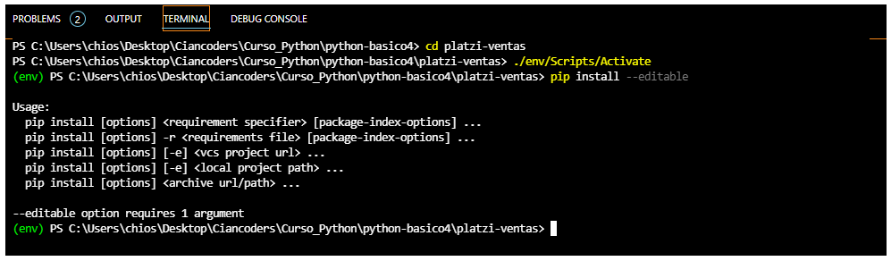

# Decoration en Python
### Permiten extender y modificar el funcionamiento de las funciones, es una funcion que envuelve otra funcion para mejorar su funcionamiento. 

## Ejemplo en 1-decoration.py

## --------------------------------------------------------------------------------------------------------------------

# OOP en python
### principios básicos: encapsulamiento, abstraccion,  inheritance, polyphormismo

## Ejemplo en 2-personas.py

## --------------------------------------------------------------------------------------------------------------------

# Click en python
### Es un framework que permite crear aplicaciones de Command Line, utiliza decoradores para implementar su funcionalidad.

### @click.group
### @click.command
### @click.argument
### @click.option

## Virtual env

## Activation Virtual env

## pip install --editable .
